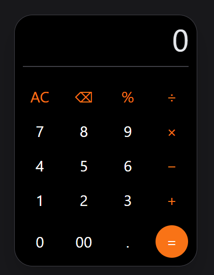

# Responsive Calculator

A responsive calculator web application built using **HTML**, **Tailwind CSS**, and **JavaScript**. The application performs basic arithmetic operations through a clean and modern interface inspired by the **Redmi Note 10 Prime Calculator**.

---

## Preview

<p align="center">
  
</p>

---

## Features

- Perform basic arithmetic operations
  - Addition (+)
  - Subtraction (−)
  - Multiplication (×)
  - Division (÷)
- Percentage (%) calculation
- Clear (AC) button
- Delete (⌫) last entered character
- Decimal number support
- Automatic font resizing for long expressions
- Responsive mobile-inspired design
- Error handling for invalid expressions
- Smooth hover and click animations


---
## Future Improvements

Possible enhancements include:

- Keyboard input support
- Scientific calculator functions
- Calculation history
- Light/Dark theme switcher
- Improved percentage calculations (similar to mobile calculators)
- Memory functions (M+, M-, MR, MC)

---
## Technologies Used

- HTML5
- Tailwind CSS
- JavaScript (ES6)

---

## Project Structure

```
calculator/
│
├── image/
│   └── calculator.png
│
├── index.html
├── script.js
└── README.md
```

---

## Author

**Sumit Pokharl**
